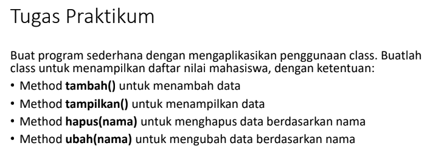
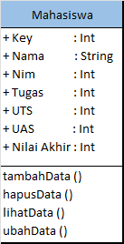
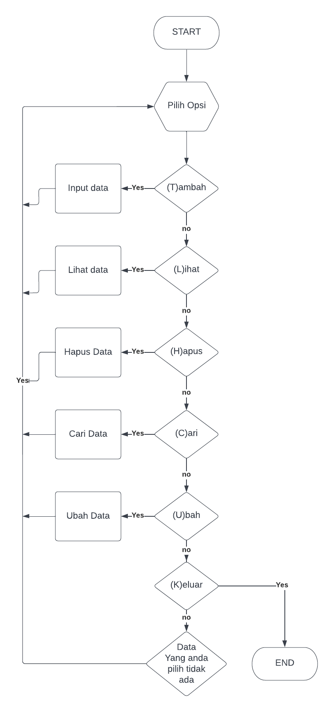
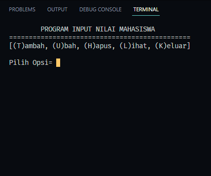
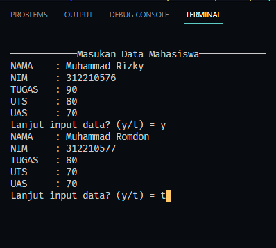
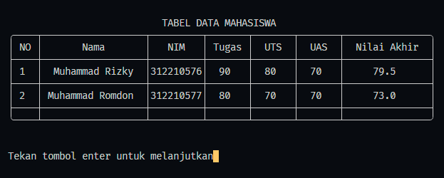
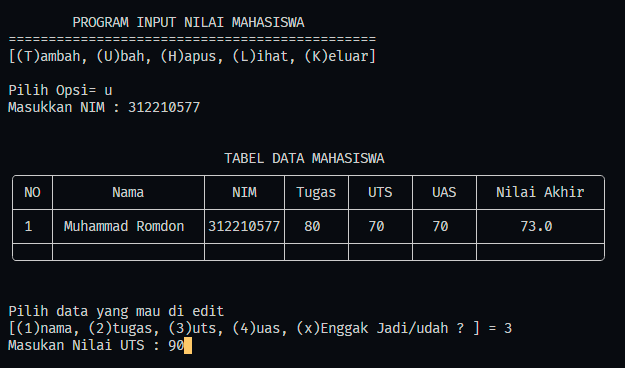
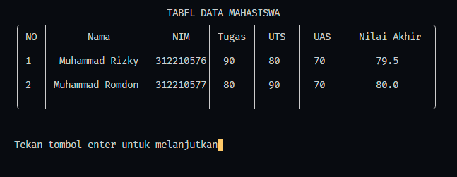
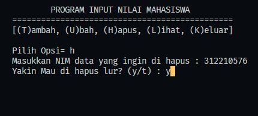
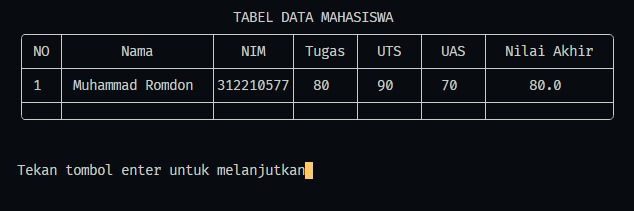

# Tugas Python Pertemuan 13
___
Nama    : Muhammad Rizky<br>
NIM     : 312210576<br>
Kelas   : TI.22.B2<br>
Mapel   : Bahasa Pemrograman<br>

**Daftar isi**
> * [Diagram Class](#diagram-class)
> * [Flowchart](#flowchart)
> * [Script dan Penjelasan](#script-dan-penjelasan)

<br>
# `Diagram Class`
<br>

# `Flowchart`
<br>

# `Script dan Penjelasan`
<br>

## `Penjelasan`
1. Membuat Class
    ```python
    class Mahasiswa():
    ```
   * Buat sebuah class bernama Mahasiswa <br>
2. Membuat Method tempat menyimpan data
    ```python
    def __init__(self):
        self.mahasiswa = {}
    ```
    * Buat sebuah ```Method __init``` yang didalamnya terdapat sebuah dictionary bernama ```mahasiswa``` untuk menyimpan data yang di inputkan<br>
3. Membuat Method Tambah data
    ```python
    def input(loop):
        os.system("cls")
        print ("\n════════════Masukan Data Mahasiswa════════════")
        no = 0
        while(loop == "y"):
            data = dict.fromkeys(mydict.mahasiswa.keys())
            while (True):
                data["nama"] = input("NAMA    : ")
                if data["nama"] == '':
                    print ('Nama tidak boleh kosong')
                else:
                    break
            while (True):
                try:
                    data["nim"]  = int(input("NIM     : "))
                    if data["nim"] == '':
                        print ('Masukan Nim dengan Angka')
                except ValueError:
                    print ('Masukan Nim dengan Angka')
                else:
                    break
            while (True):
                try:
                    data["tugas"]  = int(input("TUGAS   : "))
                    if data["tugas"] == '':
                        print ('Masukan TUGAS dengan Angka')
                except ValueError:
                    print ('Masukan TUGAS dengan Angka')
                else:
                    break
            while (True):
                try:
                    data["uts"]  = int(input("UTS     : "))
                    if data["uts"] == '':
                        print ('Masukan UTS dengan Angka')
                except ValueError:
                    print ('Masukan UTS dengan Angka')
                else:
                    break
            while (True):
                try:
                    data["uas"]  = int(input("UAS     : "))
                    if data["uas"] == '':
                        print('Masukan UAS dengan Angka')
                except ValueError:
                    print ('Masukan UAS dengan Angka')
                else:
                    break
            data["akhir"] = round(data["tugas"] * 30 / 100) + (data["uts"] * 35 / 100) + (data["uas"] * 35 / 100)
            KEY=data["nim"]
            mydict.mahasiswa.update({KEY:data})
            loop = input("Lanjut input data? (y/t) = ")
        while(loop == "t"):
            break
    ```
    * Buat Method ```input ``` untuk menambahkan data Nama, Nim, Tugas, UTS, UAS. Tambahkan nilai akhir dari proses pembagian dan pertambahan nilai Tugas, UTS, dan UAS dan jadikan Nim sebagai key value di dictionary yang sudah kita buat. <dr>  
4. Membuat Method Menampilkan data
    ```python
    def tampilkan():
        os.system("cls")
        no = 0
        print("\n")
        print(f"{'TABEL DATA MAHASISWA':^75}")
        print("╭────┬──────────────────┬─────────┬───────┬───────┬───────┬───────────────╮")
        print(f"│{'NO':^4}│{'Nama':^18}│{'NIM':^9}│{'Tugas':^7}│{'UTS':^7}│{'UAS':^7}│{'Nilai Akhir':^15}│")
        print("├────┼──────────────────┼─────────┼───────┼───────┼───────┼───────────────┤")

        for nim in mydict.mahasiswa:
            no += 1
            KEY = nim

            NAMA = mydict.mahasiswa[KEY]['nama']
            NIM = mydict.mahasiswa[KEY]['nim']
            TUGAS = mydict.mahasiswa[KEY]['tugas']
            UTS = mydict.mahasiswa[KEY]['uts']
            UAS = mydict.mahasiswa[KEY]['uas']
            AKHIR = mydict.mahasiswa[KEY]['akhir']
        
            print(f"│{no:^4}│{NAMA:^18}│{NIM:^9}│{TUGAS:^7}│{UTS:^7}│{UAS:^7}│{AKHIR:^15}│")
            print("├────┼──────────────────┼─────────┼───────┼───────┼───────┼───────────────┤")

        print("╰────┴──────────────────┴─────────┴───────┴───────┴───────┴───────────────╯")
        print("\n")
        input("Tekan tombol enter untuk melanjutkan")
    ```
    * Buat Method untuk menampilkan data yang sudah kita inputkan dengan mengambil sebuah data dari dictionary dan di masukkan ke sebuah pengulangan untuk di masukkan datanya ke dalam tabel. <br> 
5. Membuat Method Hapus data
    ```python
    def hapus(nama):
        while True:
            try:    
                nims = int(input('Masukkan NIM data yang ingin di hapus : '))
            except ValueError:
                    print ('Masukan NIM dengan angka')
            else:
                break    

        if nims in (mydict.mahasiswa.keys()):
            exekusi = input('Yakin Mau di hapus lur? (y/t) : ')
            if exekusi == 'y':
                del mydict.mahasiswa[nims]
            else :
                print("Data enggak jadi di hapus lur")
                input("Tekan enter untuk melanjutkan") 
        else :
            print("NIM yang lu input enggak ada lur") 
            input("Tekan enter untuk melanjutkan") 
    ```
    * Buat Method hapus untuk menghapus data yang ada di dictionary dengan memasukkan NIM mahasiswa, karena NIM tersebut sudah di jadikan key value.<br>
6. Membuat Method Ubah data
    ```python
    def ubah(nama):
        no = 0
        list = (mydict.mahasiswa.values())
        while True:
            try:    
                nims = int(input('Masukkan NIM : '))
            except ValueError:
                    print ('Masukan NIM dengan angka')
            else:
                break
                
        if nims in (mydict.mahasiswa.keys()):
            print("\n")
            print(f"{'TABEL DATA MAHASISWA':^75}")
            print("╭────┬──────────────────┬─────────┬───────┬───────┬───────┬───────────────╮")
            print(f"│{'NO':^4}│{'Nama':^18}│{'NIM':^9}│{'Tugas':^7}│{'UTS':^7}│{'UAS':^7}│{'Nilai Akhir':^15}│")
            print("├────┼──────────────────┼─────────┼───────┼───────┼───────┼───────────────┤")
            NAMA = mydict.mahasiswa[nims]['nama']
            NIM = mydict.mahasiswa[nims]['nim']
            TUGAS = mydict.mahasiswa[nims]['tugas']
            UTS = mydict.mahasiswa[nims]['uts']
            UAS = mydict.mahasiswa[nims]['uas']
            AKHIR = mydict.mahasiswa[nims]['akhir']
            print(f"│{1:^4}│{NAMA:^18}│{NIM:^9}│{TUGAS:^7}│{UTS:^7}│{UAS:^7}│{AKHIR:^15}│")
            print("├────┼──────────────────┼─────────┼───────┼───────┼───────┼───────────────┤")

            print("╰────┴──────────────────┴─────────┴───────┴───────┴───────┴───────────────╯")
            print("\n")
            print('Pilih data yang mau di edit')
            edit = input('[(1)nama, (2)tugas, (3)uts, (4)uas, (x)Enggak Jadi/udah ? ] = ')
            if edit == '1':
                # Belum jadi yg nim
                newNama = (input("Masukan Nama : "))
                mydict.mahasiswa[nims]["nama"] = newNama
            elif edit == '2' :
                newTugas = int(input("Masukan Nilai Tugas : "))
                mydict.mahasiswa[nims]["tugas"] = newTugas
                akhir = round(mydict.mahasiswa[nims]["tugas"] * 30 / 100) + (mydict.mahasiswa[nims]["uts"] * 35 / 100) + (mydict.mahasiswa[nims]["uas"] * 35 / 100)
                mydict.mahasiswa[nims]["akhir"] = akhir
            elif edit == '3' :
                newUts = int(input("Masukan Nilai UTS : "))
                mydict.mahasiswa[nims]["uts"] = newUts
                akhir = round(mydict.mahasiswa[nims]["tugas"] * 30 / 100) + (mydict.mahasiswa[nims]["uts"] * 35 / 100) + (mydict.mahasiswa[nims]["uas"] * 35 / 100)
                mydict.mahasiswa[nims]["akhir"] = akhir
            elif edit == '4' :
                newUas = int(input("Masukan Nilai Uas : "))
                mydict.mahasiswa[nims]["uas"] = newUas
                akhir = round(mydict.mahasiswa[nims]["tugas"] * 30 / 100) + (mydict.mahasiswa[nims]["uts"] * 35 / 100) + (mydict.mahasiswa[nims]["uas"] * 35 / 100)
                mydict.mahasiswa[nims]["akhir"] = akhir
        else:
            print("Nik lu belum ada lur")
            input("Tekan enter untuk melanjutkan")
    ```
    * Buat Method Ubah untuk mengubah data yang ada di dictionary dengan menginputkan NIM mahasiswa yang di jadikan key value di dictionary, lalu buat opsi apa yang ingin di ubah dari data yang sudah ada di dictionary. Simpan kembali ke dalam dictionary agar data yang sudah di ubah tersimpan
7. Pembuatan Opsi Run dari method yang sudah di buat
    ```python
        while True:
        os.system("cls")
        print('{0:^46}'.format("PROGRAM INPUT NILAI MAHASISWA"))
        print('{0:^46}'.format("="*46))
        # print("\n")
        print("[(T)ambah, (U)bah, (H)apus, (L)ihat, (K)eluar]")
        pilihan = input("\nPilih Opsi= ")

        if pilihan.lower() == "t":
            Mahasiswa.input("y")
        elif pilihan.lower() == "u":
            Mahasiswa.ubah("ok")
        elif pilihan.lower() == "h":
            Mahasiswa.hapus("ok")
        elif pilihan.lower() == "l":
            Mahasiswa.tampilkan()
        elif pilihan.lower() == "k":
            break
        else:
            print("Opsi yang anda pilih tidak ada di menu")
            input("Tekan enter untuk melanjutkan")
    ```
    * Buat sebuah Pengulangan yang di dalamnya terdapat statement If/else dengan pilihan opsi Tambah, Ubah, Hapus, Lihat, Dan Keluar(untuk menyelesaikan Program). 
    * Buat inputan yang bisa memanggil method tambah dengan menginputkan huruf "T", Method ubah dengan menginputkan huruf "U", Method hapus dengan menginputkan huruf "h", Method lihat dengan menginputkan huruf "L", dan input "K" untuk keluar dari program.

## `Hasil`
### Pemilihan Opsi

### Menambahkan Data

### Melihat data

### Mengubah Data
<br>

### Menghapus Data
<br>


### Terimakasih...